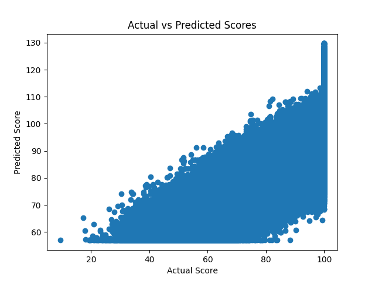

# Student Performance Prediction using Machine Learning

This project predicts student performance using machine learning techniques. The model uses behavioral features such as weekly study hours, attendance percentage, and class participation to estimate the student's total score.

## Features
- Data analysis using Pandas
- Machine learning model using Linear Regression
- Model evaluation using Mean Absolute Error
- Visualization of predicted vs actual scores

## Dataset
The dataset includes the following features:
- weekly_self_study_hours
- attendance_percentage
- class_participation
- total_score

## Technologies Used
- Python
- Pandas
- Scikit-learn
- Matplotlib
  
 ## How to Run

1. Install dependencies

pip install -r requirements.txt

2. Run the model

python student_model.py

## Model Evaluation

The model performance is evaluated using Mean Absolute Error (MAE).  
This metric measures the average difference between predicted and actual scores.

## Result
The model achieved a Mean Absolute Error of approximately **7.16**.
it will helps to visualize the real time data 

## Model Visualization

This graph shows the relationship between actual scores and predicted scores.

!!

///
